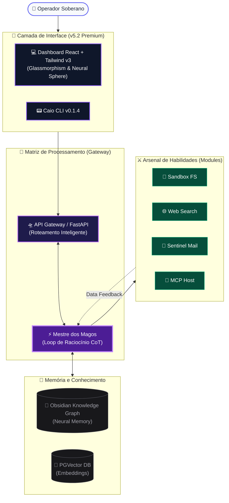
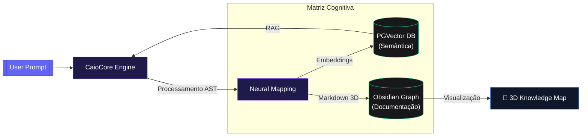

<div align="center">
  
  <h1>🛸 CaioCore v5.2 (Sovereign Intelligence)</h1>
  <p><strong>A Solução Suprema para Operações Inteligentes e Framework Unificado de IA</strong></p>
  <p>
    
    
    
  </p>
</div>

---

## ⚡ A Evolução: CaioCore v5.2 (A Onipresença Cognitiva)

Deixamos para trás a era dos multi-agentes fragmentados. Nesta evolução massiva, o **CaioCore** se consolidou como o *Mestre dos Magos*, aglomerando as habilidades de dezenas de especialistas focados (Vendas, Design, Automação, Programação, E-mails e Monitoramento) em **um único super-agente inteligente e soberano**. 

Diferente de frameworks tradicionais, o Caio v5.2 introduz o **Arsenal de Habilidades (Command Center)**, permitindo orquestração modular de ferramentas em tempo real com raciocínio encadeado (CoT).

---

### 🏗️ Arquitetura do Ecossistema (High-Level)

O CaioCore foi desenhado com alto poder de orquestração interna e loops refinados de observabilidade em Tempo Real.



---

### 🔮 Sovereign UI & Cognitive Insight

O Dashboard v5.2 não é apenas uma interface de chat; é um **Centro de Operações Táticas (War Room)**:

*   **Real-Time Reasoning Panel**: Acompanhe o "Cadeia de Pensamento" (Chain of Thought) do Caio enquanto ele orquestra ferramentas, garantindo total transparência no processo decisório.
*   **Artifact Canvas**: Visualização instantânea de código, documentos e diagramas gerados pelo agente em uma área dedicada, sem poluir o fluxo do chat.
*   **Neural Sphere Monitoring**: Feedback visual da atividade neural do sistema, indicando carga de processamento e saúde dos agentes de Tier 1.

---

### 🧠 Memória Evolutiva (Integração Automática com Obsidian)

Uma das maiores revoluções do CaioCore é como ele lida com a retenção de aprendizado prolongado através de uma **Matriz de Memória Híbrida**:



1. **Economia Imediata**: Em interações curtas ou de longo prazo, gastamos até **70% menos tokens**, pois a IA não precisa reler manuais absolutos. Ela extrai blocos de memória apenas quando necessário.
2. **Obsidian 3D**: Agora você não apenas lê logs num terminal preto; todo o mapa cerebral do Caio atualiza um repositório `.md` automaticamente. Com o **Obsidian**, você visualiza o cérebro dele em Grafos 3D!
3. **Persistência Total**: A memória inteligente e rastreada é infalível e persistente, sobrevivendo a reinicializações e atualizações de infraestrutura.

---

### ⚔️ Arsenal de Habilidades (Modules v5.2)

O Caio v5.2 não apenas conversa; ele **executa**. O Command Center permite ativar módulos específicos para cada missão:

*   **📁 Filesystem Sandbox**: Edição e criação de arquivos em ambiente isolado e seguro.
*   **🌐 Web Search (Deep Search)**: Busca profunda em tempo real via Brave/Google API para dados atualizados.
*   **📧 Sentinel Mail**: Gestão inteligente de e-mails (IMAP/SMTP) com transformadores de visualização em cards.
*   **🧩 MCP Host (Model Context Protocol)**: Integração universal com qualquer ferramenta compatível com o protocolo MCP.
*   **⏰ Orquestrador de Cron**: Agendamento de tarefas complexas e gestão de calendário Google nativa.

---

### 🔥 Comparativo de Tecnologias

Abaixo, veja o que o **CaioCore** faz em comparação à base de outros frameworks famosos no ecossistema:

| Funcionalidade Estratégica | 🛸 CaioCore (Mestre dos Magos) | 🤖 Nanobot / CaioBot | 🦁 OpenClaw |
| :--- | :--- | :--- | :--- |
| **Identidade do Agente** | **Universal Onipotente (Tudo em 1)** | Multi-agentes isolados, perda de contexto ao trocar | Focado apenas em Dev de Software/Terminal |
| **Interface Nativa / UI** | Dashboard Moderno **React + Tailwind v3 + Shadcn**, zero lag de chat e responsivo | Linhas de comando feias ou WebView HTML estático | Apenas Prompt e Shell puro |
| **Processamento de E-mails** | Busca IMAP robusta. Transforma textos sujos em **Cards visuais limpos no Frontend** | Não possui / Precisa de plugin limitador | Não possui capacidade de caixa de entrada nativa |
| **Gestão de Custos** | Sistema embutido de Observabilidade (**`TokenAgent`**) para monitorar gastos precisos por IA | Sem rastreio consolidado | Limitado a logs perdidos no terminal |
| **Roteamento Smart** | Roteia dinamicamente LLMs de acordo com o peso da requisição (Gemini, Groq, Claude) | Configuração travada por sistema | Seleção travada para o modelo mais caro (Claude) |

<div align="center">
  
  <p><i>Novo Painel Central CaioCore: Minimalista, UI Responsiva React/Vite, Tracker Visual Integrado</i></p>
</div>

---

## 🛠️ Guia Completo de Instalação (Local)

Para desenvolver ou auditar e rodar na sua máquina com Windows/Linux/Mac:

1. **Clone o repositório:**
   ```bash
   git clone https://github.com/gleisson-santos/agente_caio.git
   cd agente_caio
   ```
2. **Sistema Virtual (VENV):** Recomendamos utilizar Python 3.11+.
    ```bash
    python -m venv .venv
    # Ative o ambiente local
    source .venv/bin/activate  # Linux/Mac
    .venv\Scripts\activate     # Windows
    ```
3. **Instale as dependências modulares:**
   Escolha a profundidade da sua versão do Caio:
   - *Padrão (Core):* `pip install -e .`
   - *Browser/Visão:* `pip install -e ".[browser]"` -> *(Instala a visao computacional e Playwright para "assistir" scraping).*
   - *Extremo (Todas APIs):* `pip install -e ".[all]"`

### Configurando o Coração (`config.json` e `token.json`)

Para gerar as conexões e habilitar as integrações autônomas do Caio (Telegram, Agenda e Imap):
Copie `config.example.json` para `config.json` e insira suas predefinições.

- **Para o Gmail (IMAP/SMTP):** O uso obrigatório de Senhas de App do Google (não use sua senha mestra).
- **Para o Google Calendar:** Rode o utilitário nativo executando `python tools/gerar_token_google.py`. Faça login no navegador pop-up e o arquivo autenticado `token.json` será criado com perfeição para uso eterno.

### Dando Partida Rápida
```bash
caio gateway
```
✅ **Tudo on-line!** O `caio gateway` acorda as rotas do backend (Porta `18790`) em multi-janela assíncrona blindada, já levantando rastreamento pronto pro Frontend (Vite) conectar sem CORS.

---

## 2. Produção Elite: Deploy em VPS (Docker Swarm / Portainer)

Preparado pro mundo real com balanceamento de nós em Swarm, proxies dinâmicos do Traefik, separação violenta do Banco Vetorial e de uso. 
📋 **Leia a Bíblia de Infra:** ➡️ [**DEPLOY_VPS.md**](DEPLOY_VPS.md) ⬅️

---

## 📢 Melhorias Realizadas (CaioCore Evolution) 💥

### 🛸 v5.2 — Sovereign Intelligence
*   **Neural Memory Graph**: Integração profunda com Obsidian via AST para visualização 3D do conhecimento.
*   **Arsenal de Habilidades**: Interface de comando modular (Command Center) para ativação de ferramentas on-the-fly.
*   **Real-Time Reasoning (CoT)**: Painel de pensamento visível, permitindo auditar o raciocínio da IA antes da resposta final.
*   **Performance Zero-Lag**: Refatoração completa do motor de renderização do Dashboard para suportar streams massivos sem perda de FPS.

### ⚡ v4.0 — Premium UI/UX
*   **Remoção das Bordas UI**: Design "Borderless" Premium para foco total na produtividade.
*   **Latência de React (Eliminada)**: Uso intensivo de `useCallback` e `memo` para digitação fluida.
*   **Integração TokenAgent**: Monitoramento de custos em tempo real diretamente no painel principal.
*   **Cards de E-mail**: Visualização modular de e-mails Sentinel via Tailwind Pro.

---

## 🤝 Créditos e Contato

**Arquiteto/Desenvolvedor Chefe:** Gleisson Santos  
**Ecossistema Principal/Deploy:** Plataforma UomniMind  

<div align="center">
  <p><strong>Agente Caio — A Onipresença Cognitiva da Automação.</strong></p>
</div>
