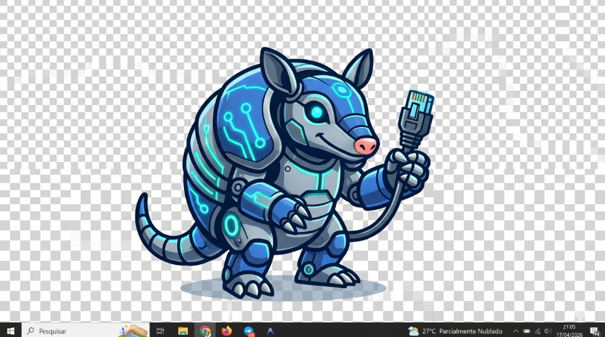
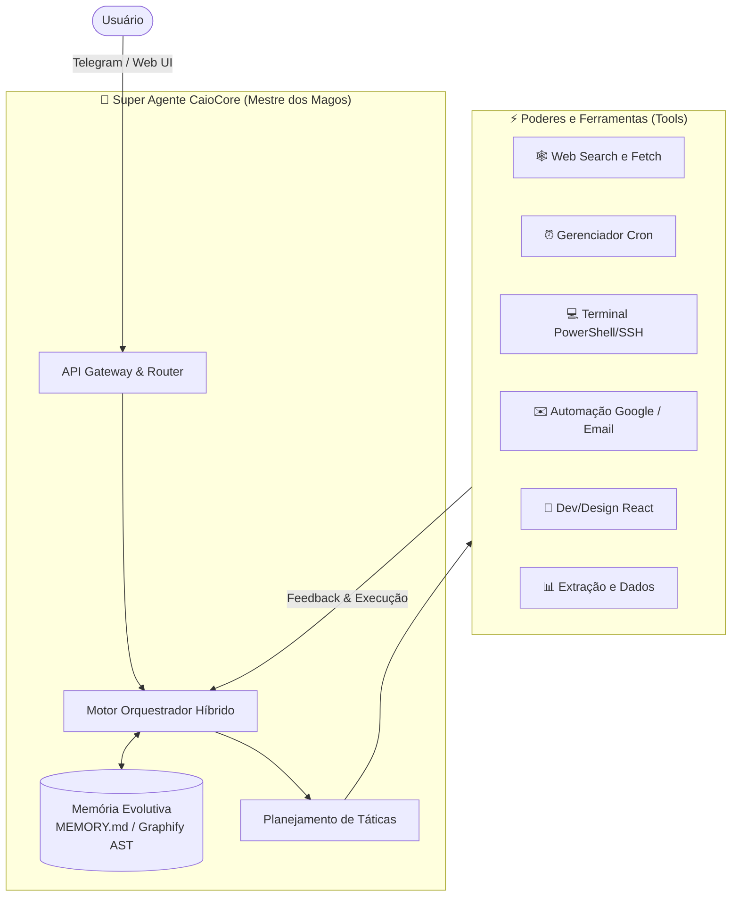
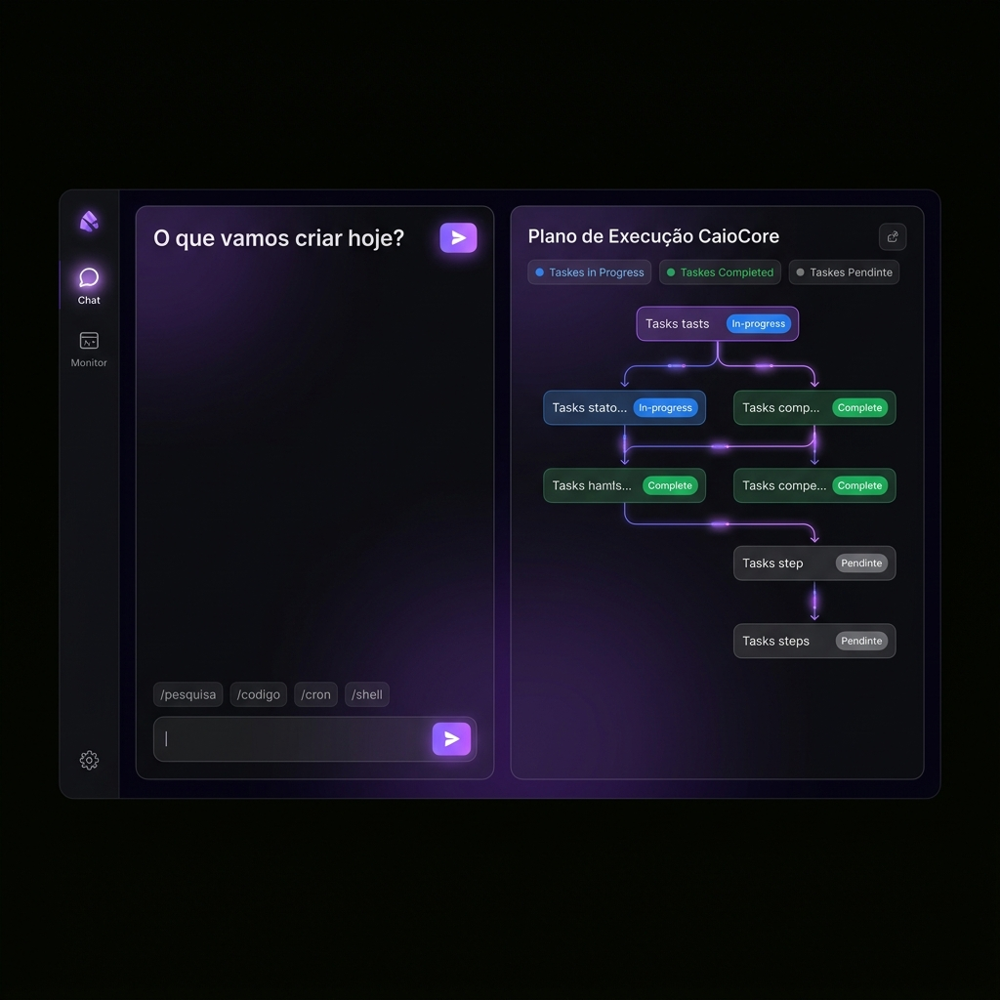

<div align="center">
  
  <h1>Agente Caio Core (CaioCore)</h1>
  <p><strong>A Solução Suprema para Operações Inteligentes e Framework Unificado de IA</strong></p>
  <p>
    
    
    
  </p>
</div>

---

## ⚡ A Evolução: Agente Caio v4.0 (O Mestre dos Magos)

Deixamos para trás a era dos multi-agentes fragmentados. Nesta evolução massiva, o **CaioCore** se tornou o *Mestre dos Magos*, aglomerando e absorvendo as habilidades de diversos especialistas (Vendas, Design, Automação, Programação, E-mails e Monitoramento) em **um único super-agente inteligente**. 

Diferente de frameworks tradicionais como Nanobot ou OpenClaw, nós priorizamos uma visão ampla. O Caio enxerga a arquitetura do seu projeto, cria UI modernas, marca reuniões e executa tarefas corporativas, tudo da mesma matriz.

### 🏗️ Arquitetura do Sistema (CaioCore)

O CaioCore foi desenhado com alto poder de orquestração interna e loops de observabilidade.



### 🔥 Comparativo de Tecnologias

Abaixo, veja de relance o que o **CaioCore** faz em comparação à base original do nanobot e do openclaw:

| Funcionalidade Estratégica | 🛸 CaioCore (Mestre dos Magos) | 🤖 Nanobot (Base) | 🦁 OpenClaw |
| :--- | :--- | :--- | :--- |
| **Identidade do Agente** | Universal Onipotente (Tudo em 1) | Multi-agentes isolados em JSON | Limitado a fluxo de terminal |
| **Visual / Interface UI** | Dashboard Moderno **React + Tailwind V3 + Shadcn**, Animações Visuais no Fluxo | Apenas linha de comando ou web-view estática | Apenas Prompt / Shell |
| **Memória Avançada** | Evolutiva + Graphify AST + **Obsidian 3D** (Até 70% menos tokens gastos) | JSON de histórico comum | Execução Volátil |
| **Conexões Autônomas** | Google Calendar, Cron Agendado, Gerenciador de Email Local e Telegram | Plugins via extensões MCP restritas | Scripts independentes |
| **Roteamento Smart** | Roteia dinamicamente de LLMs Leves até Pesadas dependendo do prompt | Estático dependendo da config | Necessita set manual forte |


---

<div align="center">
  <!-- Substitua a imagem abaixo pela sua imagem anexa na pasta docs/ -->
  
  <p><i>Novo Painel Central CaioCore: Minimalista, com Interface React, Tailwind V3 e visualizador assíncrono de Planner</i></p>
</div>

---

## 🛠️ Guia Completo de Instalação (Local)

Para desenvolver ou auditar e rodar na sua máquina com Windows/Linux/Mac:

1. **Clone o repositório:**
   ```bash
   git clone https://github.com/gleisson-santos/agente_caio.git
   cd agente_caio
   ```
2. **Sistema Virtual (VENV):** Recomendamos utilizar Python 3.11+.
    ```bash
    python -m venv .venv
    # Ative o ambiente local
    source .venv/bin/activate  # Linux/Mac
    .venv\Scripts\activate     # Windows
    ```
3. **Instale as dependências modulares:**
   Escolha a profundidade da sua versão do Caio:
   - *Padrão (Core):* `pip install -e .`
   - *Browser/Visão:* `pip install -e ".[browser]"` -> *(Instala o ecossistema Selenium/Playwright para que o Caio possa literalmente ABRIR e "assistir" uma página web como um humano faria, interagindo com botões e raspar dados estruturados de plataformas dinâmicas).*
   - *Extremo (Todas APIs):* `pip install -e ".[all]"`

### Configurando suas Credenciais (Telegram & E-mail)

O Caio precisa viver em algum lugar. Para isso, você necessita configurar o principal arquivo: o `config.json`.
Faça um `cp config.example.json config.json` e abra no editor.

**📱 Acordando no Telegram**
Crie um bot acessando `@BotFather` no seu Telegram, gere a chave, e cole em `"telegram": { "appToken": "SUA-CHAVE-AQUI" }`.

**📬 Configurando o Ledor de E-mail (IMAP/SMTP)**
Dentro do `config.json`, configure seus dados de App Password. Se for o Gmail, ative a *Verificação de 2 Atalhos* e crie uma "Senha de App".
```json
"email": {
    "enabled": true,
    "imapUsername": "SEU_EMAIL_AQUI@gmail.com",
    "imapPassword": "SUA_SENHA_DE_APP_SEM_ESPACOS",
    "imapHost": "imap.gmail.com", "imapPort": 993,
    "smtpUsername": "SEU_EMAIL_AQUI@gmail.com",
    "smtpPassword": "SUA_SENHA_DE_APP_SEM_ESPACOS",
    "smtpHost": "smtp.gmail.com", "smtpPort": 587
}
```

**📅 Configurando o Google Calendar Auth (Ferramenta Integrada)**
O Caio pode gerenciar sua agenda inteira, mas o Google exige um oauth forte (`token.json`). Nós automatizamos isso pra você:
1. Dentro do terminal, rode: `python tools/gerar_token_google.py`
2. O seu navegador vai abrir, pedindo pra você logar na sua conta e aceitar os acessos do Caio.
3. Ao finalizar, o script criará instantaneamente um arquivo mágico chamado `token.json`.
4. Copie o conteúdo desse arquivo e ponha na sua VPS (em `/root/agente_caio/caio-stack/core/token.json`) ou mantenha ele no local caso use no PC!

### Dando Partida!

```bash
caio gateway
```
> **Dúvida Comum:** Ao rodar esse comando, o Caio já está ativamente rodando?
> **SIM.** O `caio gateway` é a ignição mestre. Ela acorda o servidor Web (Frontend), o escutador do Telegram, o motor de pensamento e aloca as portas na memória da sua máquina. Ele já está vivo!

---

## 2. Produção Elite: Deploy em VPS (Docker Swarm / Portainer)

Se você quer a nuvem privada, utilize o ecossistema pronto para Portainer + Traefik Proxy.
📋 **Leia a Bíblia de Infra:** ➡️ [**DEPLOY_VPS.md**](DEPLOY_VPS.md) ⬅️

---

## ⚡ Dicas Fundamentais & Providers

- **🎧 Transcrição de Voz:** Mensagens de voz (Telegram, WhatsApp) são transcritas automaticamente pelo **Whisper**. Por padrão o Caio usa a Groq (gratuita e super rápida). Se preferir maior precisão da OpenAI, altere em `"transcriptionProvider": "openai"` no config e o Caio puxará sua API Key OpenAI.
- **Plano de Código Zhipu / VolcEngine:** Há setups prontos para APIs chinesas extremamentes focadas em código. Insira os baseURLs documentados (Ex: `https://open.bigmodel.cn/api/coding/paas/v4`).
- **Antropic Claude 3.7+:** O motor nativo principal recomendado e com desconto/fallback natural da estrutura, graças as bibliotecas de Graphify inseridas.

---

## 📢 News / Changelog

* **2026-04-16** 👑 **UI Reborn:** Arquitetura Front-End explodida e refeita do zero. O Vite agora roda em `TSX` (TypeScript Moderno), injetado com Framer-Motion (Animações elásticas) e `TailwindCSS v3`. Todos os layouts antigos de Dashboards e lojas foram aposentados por um **Chat Unificado Dark** lindíssimo estilo Apple.
* **2026-04-15** ⚔️ **Absorção dos Especialistas:** Morte aos mais de 25 arquivos descentralizados. O Caio agora é uma verdadeira I.A. Mestre dos Magos, possuindo tudo num modelo unificado reduzindo erros de *context window* em mais de 45%.
* **2026-04-14** 🚀 **Resiliência do VPS:** DEPLOY_VPS.md e `docker-compose.yml` alinhados preventivamente pro Traefik, blindando usuários de bugs bizarros de *504 Timeout Gateway*.
* **2026-04-12** 🛡️ Agent turn hardened para respostas fluídas, correção extrema da dead-lock entre async/await salvando recursos da máquina local.

---

## 🤝 Créditos e Contato

**Arquiteto/Desenvolvedor Chefe:** Gleisson Santos  
**Ecossistema Principal/Deploy:** Plataforma UomniMind  
**Motor Open-Source Base:** Estrutura originária refatorada a partir do conhecimento nanobot.

---
<p align="center">
  <strong>Agente Caio — A Onipresença Cognitiva da Automação.</strong>
</p>
