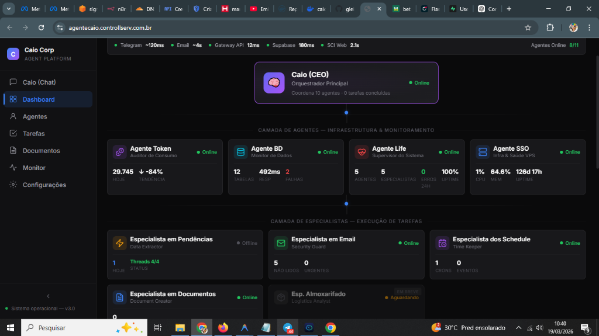

<div align="center">
  
  <h1>🐱 Agente Caio Core (CaioCore)</h1>
  <p><strong>A Solução Suprema para Operações Inteligentes e Monetização de Agentes IA</strong></p>
  <p>
    
    
    
  </p>
</div>

---

## 🚀 O que é o CaioCore?

O **CaioCore** é um ecossistema de agentes de IA de alto nível, projetado para ser comercializado e escalado. Diferente de bots simples, o CaioCore utiliza uma arquitetura hierárquica baseada no conceito de **Orquestrador Central (CEO)** e **Especialistas de Execução (Tier 2)**.

Este projeto nasceu da necessidade de entregar uma ferramenta poderosa para automação de negócios, integrando perfeitamente Canais (Telegram, E-mail, Dashboard), Memória de Longo Prazo e Habilidades Avançadas.

> [!IMPORTANT]
> Inspirado na base do Nanobot, o CaioCore foi totalmente remodelado por **Gleisson Santos** para focar em UX, instalação simplificada e uma "App Store" de agentes premium.

---

## 💎 Loja de Agentes (Monetização)

O diferencial do CaioCore é a **Loja de Agentes** integrada ao Dashboard. Enquanto o núcleo do agente é open-source, os **Especialistas de Elite** podem ser adquiridos e ativados via Dashboard:

### 🛍️ Agentes Disponíveis na Versão Premium:
- **📊 Criador de Carrosséis Viral:** Transforma ideias em posts épicos para Instagram.
- **🎨 Lovable Prompt Artist:** Arquiteto sênior para criar apps no Lovable.dev.
- **🏠 Prospecção Imobiliária:** Máquina de qualificação de leads para corretores.
- **🛒 Especialista E-commerce (CRO):** Focado em fechar vendas e recuperar carrinhos.
- *...e mais de 20 modelos prontos!*

---

## 🛠️ Instalação Rápida (Estilo Pro)

Esqueça a edição manual de arquivos JSON complexos. O CaioCore agora possui um assistente de instalação interativo.

1. **Clone o repositório:**
   ```bash
   git clone https://github.com/gleisson-santos/agente_caio.git
   cd agente_caio
   ```

2. **Instale as dependências:**
   ```bash
   pip install -e .
   ```

3. **Inicie o Assistente de Configuração:**
   ```bash
   caio setup
   ```
   *O assistente pedirá seu Token do Telegram, Chave da API (OpenRouter/OpenAI) e configurará seu Workspace automaticamente.*

### ⚖️ Instalação Modular (Otimizada)
O CaioCore é desenhado para ser leve. Você pode escolher o que instalar:
- **Core (Lite):** `pip install -e .` (Apenas o essencial: Telegram + AI + Docs)
- **Com Navegador (Selenium):** `pip install -e ".[browser]"`
- **Com Análise de Dados (Pandas):** `pip install -e ".[data]"`
- **Completo:** `pip install -e ".[all]"`

4. **Suba o Motor:**

   ```bash
   caio gateway
   ```

---

## 🐳 Deploy Profissional (Portainer & Traefik)

O CaioCore foi desenhado para rodar em VPS de alta performance usando Docker Swarm.

### Configuração do Ingress (IMPORTANTE)
No arquivo `docker-compose.yml`, altere as linhas de `Host` para o seu domínio real:
```yaml
- traefik.http.routers.caio-dashboard.rule=Host(`SEU DOMINIO`)
```

### Stack Completa
Acesse o manual completo de deploy em [WALKTHROUGH_SETUP.md](WALKTHROUGH_SETUP.md).

---

## 🧠 Recursos Exclusivos

*   **Fallback Inteligente:** Se o modelo principal (ex: Grok-4.1-fast) falhar, o Caio aciona automaticamente o modelo reserva configurado para garantir que você nunca fique na mão.

*   **Memória Dual:** Sistema avançado que separa Memória de Curto Prazo (Bus) da Memória de Longo Prazo (`MEMORY.md`), permitindo que o agente "aprenda" sobre você com o tempo.
*   **Controle de Especialistas:** Use a arroba para invocar um especialista no chat, ex: `@carrossel crie um post sobre IA`.

---

## 🤝 Créditos e Contato

**Desenvolvedor:** Gleisson Santos  
**Plataforma de Base:** Nanobot AI Framework (HKUDS)  
**Suporte Premium:** [controllserv.com.br](http://controllserv.com.br)

---
<p align="center">
  <strong>Agente Caio — Potencializando Humanos com Inteligência Artificial Executável.</strong>
</p>
