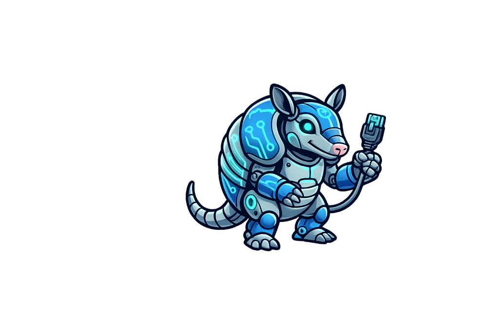
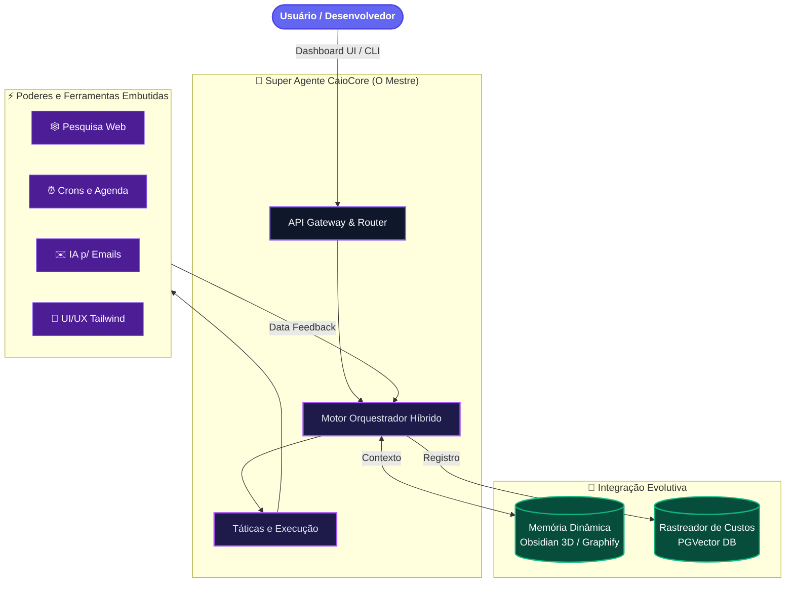

<div align="center">
  
  <h1>🛸 Agente Caio Core (CaioCore)</h1>
  <p><strong>A Solução Suprema para Operações Inteligentes e Framework Unificado de IA</strong></p>
  <p>
    
    
    
  </p>
</div>

---

## ⚡ A Evolução: Agente Caio v4.1 (O Mestre dos Magos)

Deixamos para trás a era dos multi-agentes fragmentados. Nesta evolução massiva, o **CaioCore** se consolidou como o *Mestre dos Magos*, aglomerando as habilidades de dezenas de especialistas focados (Vendas, Design, Automação, Programação, E-mails e Monitoramento) em **um único super-agente inteligente**. 

Diferente de frameworks tradicionais como o *OpenClaw* ou simples automações como o *Nanobot*, o Caio tem uma visão analítica do todo. Ele entende nativamente a arquitetura do seu projeto, gera sua interface de usuário, marca reuniões e roda automações corporativas de infraestrutura — tudo sendo governado por apenas **uma matriz cognitiva**.

---

### 🏗️ Arquitetura do Sistema (CaioCore)

O CaioCore foi desenhado com alto poder de orquestração interna e loops refinados de observabilidade em Tempo Real.



---

### 🔥 Comparativo de Tecnologias

Abaixo, veja o que o **CaioCore** faz em comparação à base de outros frameworks famosos no ecossistema:

| Funcionalidade Estratégica | 🛸 CaioCore (Mestre dos Magos) | 🤖 Nanobot / CaioBot | 🦁 OpenClaw |
| :--- | :--- | :--- | :--- |
| **Identidade do Agente** | **Universal Onipotente (Tudo em 1)** | Multi-agentes isolados, perda de contexto ao trocar | Focado apenas em Dev de Software/Terminal |
| **Interface Nativa / UI** | Dashboard Moderno **React + Tailwind v3 + Shadcn**, zero lag de chat e responsivo | Linhas de comando feias ou WebView HTML estático | Apenas Prompt e Shell puro |
| **Processamento de E-mails** | Busca IMAP robusta. Transforma textos sujos em **Cards visuais limpos no Frontend** | Não possui / Precisa de plugin limitador | Não possui capacidade de caixa de entrada nativa |
| **Gestão de Custos** | Sistema embutido de Observabilidade (**`TokenAgent`**) para monitorar gastos precisos por IA | Sem rastreio consolidado | Limitado a logs perdidos no terminal |
| **Roteamento Smart** | Roteia dinamicamente LLMs de acordo com o peso da requisição (Gemini, Groq, Claude) | Configuração travada por sistema | Seleção travada para o modelo mais caro (Claude) |

---

### 🧠 Memória Evolutiva (Integração Automática com Obsidian)

Uma das maiores revoluções do CaioCore é como ele lida com a retenção de aprendizado prolongado:
Enquanto agentes comuns esquecem detalhes críticos quando as conversas ficam grandes, o **CaioCore escreve diretamente no formato Abstract Syntax Tree (AST)** exportável.

1. **Economia Imediata**: Em interações curtas ou de longo prazo, gastamos até **70% menos tokens**, pois a IA não precisa reler manuais absolutos. Ela extrai blocos de memória apenas quando necessário.
2. **Obsidian 3D**: Agora você não apenas lê logs num terminal preto; todo o mapa cerebral do Caio atualiza um repositório `.md` automaticamente. Isso significa que com softwares como **Obsidian** você consegue visualizar o cérebro dele em Grafos 3D das interações!
3. **Persistência Total**: Não importa quantas vezes você reinicie o Docker ou as instâncias (Swarm). A memória inteligente e rastreada é infalível e persistente.

---

<div align="center">
  
  <p><i>Novo Painel Central CaioCore: Minimalista, UI Responsiva React/Vite, Tracker Visual Integrado</i></p>
</div>

---

## 🛠️ Guia Completo de Instalação (Local)

Para desenvolver ou auditar e rodar na sua máquina com Windows/Linux/Mac:

1. **Clone o repositório:**
   ```bash
   git clone https://github.com/gleisson-santos/agente_caio.git
   cd agente_caio
   ```
2. **Sistema Virtual (VENV):** Recomendamos utilizar Python 3.11+.
    ```bash
    python -m venv .venv
    # Ative o ambiente local
    source .venv/bin/activate  # Linux/Mac
    .venv\Scripts\activate     # Windows
    ```
3. **Instale as dependências modulares:**
   Escolha a profundidade da sua versão do Caio:
   - *Padrão (Core):* `pip install -e .`
   - *Browser/Visão:* `pip install -e ".[browser]"` -> *(Instala a visao computacional e Playwright para "assistir" scraping).*
   - *Extremo (Todas APIs):* `pip install -e ".[all]"`

### Configurando o Coração (`config.json` e `token.json`)

Para gerar as conexões e habilitar as integrações autônomas do Caio (Telegram, Agenda e Imap):
Copie `config.example.json` para `config.json` e insira suas predefinições.

- **Para o Gmail (IMAP/SMTP):** O uso obrigatório de Senhas de App do Google (não use sua senha mestra).
- **Para o Google Calendar:** Rode o utilitário nativo executando `python tools/gerar_token_google.py`. Faça login no navegador pop-up e o arquivo autenticado `token.json` será criado com perfeição para uso eterno.

### Dando Partida Rápida
```bash
caio gateway
```
✅ **Tudo on-line!** O `caio gateway` acorda as rotas do backend (Porta `18790`) em multi-janela assíncrona blindada, já levantando rastreamento pronto pro Frontend (Vite) conectar sem CORS.

---

## 2. Produção Elite: Deploy em VPS (Docker Swarm / Portainer)

Preparado pro mundo real com balanceamento de nós em Swarm, proxies dinâmicos do Traefik, separação violenta do Banco Vetorial e de uso. 
📋 **Leia a Bíblia de Infra:** ➡️ [**DEPLOY_VPS.md**](DEPLOY_VPS.md) ⬅️

---

## 📢 Melhorias Realizadas na Série v4 💥

Ao longo desta versão, implementamos correções arquiteturais ferozes na matriz:
* **Remoção das Bordas UI**: Limpeza completa no Dashboard para ficar idêntico ao modelo "borderless" Premium, resultando numa área de trabalho que reflete calma e organização.
* **Latência de React (Eliminada)**: Modificações com `useCallback` extinguiram o lag que acontecia ao digitar no Web UI quando o agente respondia e renderizava muitos cartões no Markdown.
* **Integração Real-Time do TokenAgent**: Agora você pode verificar a exata soma dos Tokens usados (H.) no card do Monitoramento do painel. Acabou a escuridão sobre onde vai sua franquia de APIs.
* **Blockquote Cards Nativo**: E-mails listados formam visualizações modulares (quadradinhos elegantes com contornos) via TailWind Pro, abandonando aquele texto grudado e caótico que era típico de Respostas antigas.

---

## 🤝 Créditos e Contato

**Arquiteto/Desenvolvedor Chefe:** Gleisson Santos  
**Ecossistema Principal/Deploy:** Plataforma UomniMind  

<p align="center">
  <strong>Agente Caio — A Onipresença Cognitiva da Automação.</strong>
</p>
